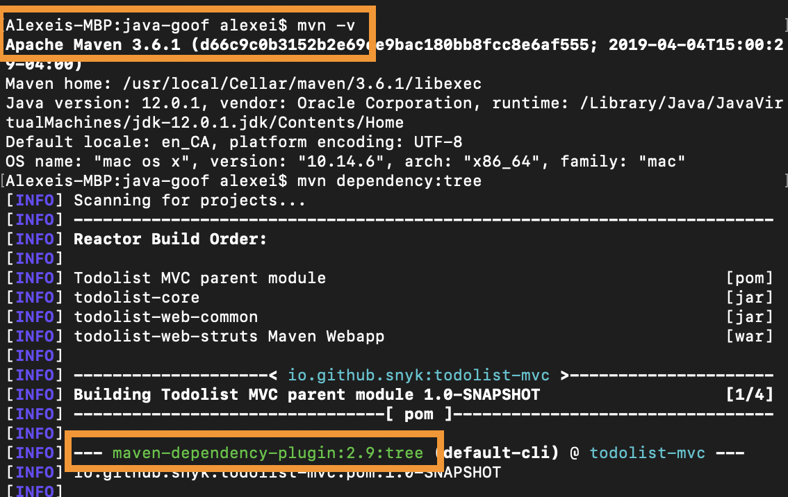

# Scan all unmanaged jar files

Snyk CLI is able to scan unmanaged jar files in [Java applications](https://support.snyk.io/hc/en-us/articles/360003817357-Snyk-for-Java-Gradle-Maven-). The package name, version, and vulnerabilities are identified by the CLI only if the local jar file hash matches the Maven Central jar file hash.

Java apps typically have jar files in a number of locations within an application. Scanning multiple jar files in the same folder can lead to problems. Instead, scanning individual jar files is considered best practice, especially for old Java apps that use Ant.

**WAR file support**: this approach can be used with war files that are published in Maven Central. All other war files or jar files containing other jars will need to be extracted \(unzipped\) in order to scan open-source dependency jars directly.

**Prerequisite:** This functionality requires **Maven 3.1.0** or newer to be installed alongside Snyk CLI, which requires **maven-dependency-plugin 2.2** or higher.

To view version differences:



Snyk CLI looks through all JAR files in a single folder to match any dependencies hosted on Maven central using the `snyk test —scan-all-unmanaged` command. However, this functionality may be problematic if an application wasn’t built using a package manager like Gradle or Maven in the first place as it may lead to dependency conflicts. This is especially relevant for applications built using Ant.

It is, therefore, best to test each JAR file individually using `snyk test —scan-unmanaged —file=/path/to/file`. Testing each JAR file individually will also have a side-effect of Snyk Web UI showing the name of the JAR file that was scanned while running a scan using `—scan-all-unmanaged` doesn't do that. In order to find and test JAR files in all sub-folders of an application, a simple wrapper is required. Results can then be grouped in Snyk UI using `—remote-repo-url=AppName` argument.

Below is a Linux/Mac BASH script that will iterate through all subfolders starting with the current folder and test each individual JAR file. The **PROJECT\_NAME\_HERE** part in **—remote-repo-url** is important as it will combine multiple scan results under a single Snyk project in the UI.

```text
find . -type f -name '*.jar' | uniq | xargs -I {} snyk monitor --file={} --scan-unmanaged --remote-repo-url=PROJECT_NAME_HERE
```

The following is a Windows Batch script. The batch script is run from a **scanjar.bat** file.

```text
REM Usage:    
REM For example: scanjar.bat "C:\workspace\app" "myapp" 
SET workspace=%1 
SET appname=%2 
for /R %workspace% %%f in (*.jar) do cmd /c snyk monitor --scan-unmanaged --remote-repo-url=%appname% --file=%%f
```

Here's what the end result should look like in Snyk UI for an app with **—remote-repo-url=econnect**



Ready to get started with Snyk? [Sign up for free!](https://snyk.io/login?cta=sign-up&loc=footer&page=support_docs_page)


