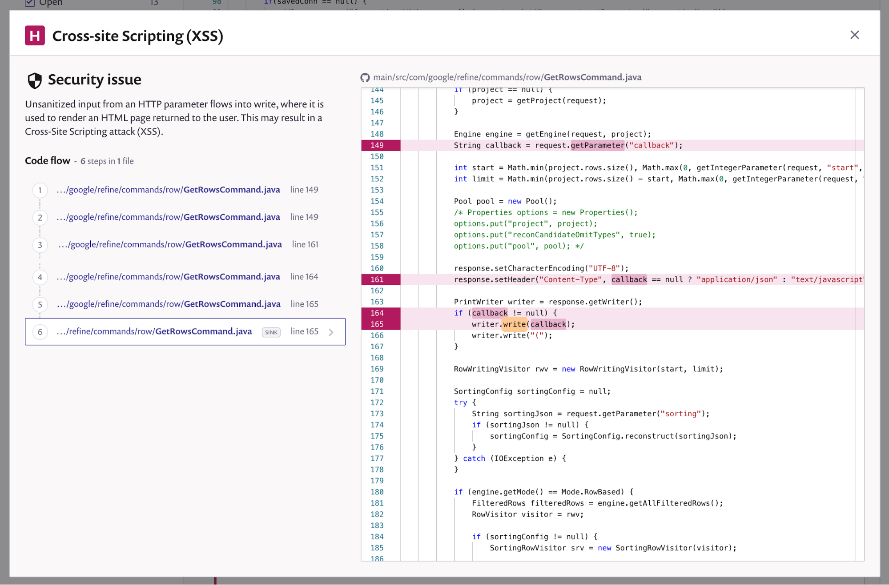

# Snyk Code

## **Integrated platform**

Snyk Code expands the Snyk cloud-native application security platform, supporting all elements for a modern software supply chain. For a cloud-native application, this provides security for:

* [**Snyk Code**](https://snyk.gitbook.io/user-docs/snyk-code): the application’s proprietary code.
* [**Snyk Open Source**](https://snyk.gitbook.io/user-docs/snyk-open-source): the open-source libraries it leverages.
* [**Snyk Container**](https://snyk.gitbook.io/user-docs/snyk-container): the container it runs in.
* [**Snyk Infrastructure as Code**](https://snyk.gitbook.io/user-docs/snyk-infrastructure-as-code): the infrastructure as code that provisions it.

## How does static application security testing \(SAST\) work?

1. Checks and reads for DeepCode/Snyk ignore specific files `.gitignore` `.dcignore` \(if they exist\).
2. Using the information obtained in step 1, we are filtering to get only the following source code files:
   1. `.es,.es6,.htm,.html,.js,.jsx,.ts,.tsx,.vue,.java,.CS,.Cs,.cs,.py`
   2. We are accessing only the files in the project directory. We do not go above the current project directory.
3. Files which size is less than 4 MB found in step 2 are bundled and the bundle is sent to Snyk.

## Developer-first approach

Snyk Code is developer-first, embedding SAST as part of the development process, enabling developers to build software securely during development, not trying to find and fix problems after the code is compiled. Snyk Code works in the IDEs and SCMs developers use to build and review software and provides fast, actionable, meaningful results to fix issues in real-time.

## Snyk Code AI engine

Snyk Code is powered by machine learning based on an AI engine. This engine learns from millions of open-source commits and is paired with Snyk’s Security Intelligence database, creating a continually growing code security knowledge base.

The Snyk Code engine expresses rules that capture results of analysis, plus meta information such as explanations and examples.

## Fast and accurate code flaws detection

Snyk Code is significantly faster and more accurate than other conventional SAST products:

* The semantic analysis engine added via Snyk Code, trained on Snyk’s Vulnerability Database, reduces false positives to near-zero.
* Due to our proprietary engine, Snyk Code is up to 50x faster than traditional SAST solutions, enabling security during the development process, with no delays.

## Secret detection in source code

Snyk Code includes secret detection capabilities that scan and highlight secrets like keys, credentials, PII, and sensitive information in your source code. Unlike tools that use entropy checks or regular expressions, Snyk Code uses machine learning and is able to learn from experience, improving the odds of accurately detecting secrets while minimizing false positives.

## Issue code flow visualization

Snyk products all provide a developer-friendly experience, so Snyk Code helps developers to quickly understand the problem, learn the background, and how to approach it. Snyk Code helps you understand the dangerous code flow step-by-step.

For every issue, Code also provides a link to the lines in the relevant files, to view more details on the problem like the CWE, and how to approach it.

Snyk Code also provides rich curated additional information for many suggestions.

## Supported integrations

Snyk Code integrates with the cloud versions of:

* [GitHub](https://snyk.gitbook.io/user-docs/integrations/git-repository-scm-integrations/github-integration)
* [GitLab](https://snyk.gitbook.io/user-docs/integrations/git-repository-scm-integrations/gitlab-integration)
* [Bitbucket](https://snyk.gitbook.io/user-docs/integrations/git-repository-scm-integrations/bitbucket-cloud-integration) 
* [Azure](https://snyk.gitbook.io/user-docs/integrations/git-repository-scm-integrations/azure-repos-integration)

## Using integrations

You can seamlessly import and continuously monitor your repositories, and discover security flaws in the source code files in them using static analysis.

This integration allows you to:

* Manage Code projects using your existing native import flow and tools
* View and prioritize security issues found in the source code
* Run a retest of a project and see history snapshots of a project

## Supported languages

Snyk Code supports Java, JavaScript \(including TypeScript\), Python and C\#.

See [Snyk Code language support](https://snyk.gitbook.io/user-docs/snyk-code/snyk-code-language-and-framework-support) for more information.

## Snyk Code IDE plugins

IDE integrations use Snyk Code’s fast analysis and response, allowing you to spot an issue, understand and learn more about it, and fix it, as you write the code before you check the code in. So you can find possible security flaws in your code as you write it, on a line-by-line basis.

## JetBrains IDE plugin

Snyk Code supports a JetBrains plugin to support issue finding and fixing, directly from the IDE:

For more details, see [JetBrains IDE Plugins](https://snyk.gitbook.io/user-docs/integrations/ide-tools/jetbrains-plugins).

## VS Code IDE plugin

Snyk Code supports a Visual Studio Code plugin to support issue finding and fixing, directly from the IDE:

For more details, see the [Visual Studio Code extension for Snyk Code](https://snyk.gitbook.io/user-docs/integrations/ide-tools/visual-studio-code-extension-for-snyk-code-).

 
  


Ready to get started with Snyk? [Sign up for free!](https://snyk.io/login?cta=sign-up&loc=footer&page=support_docs_page)
