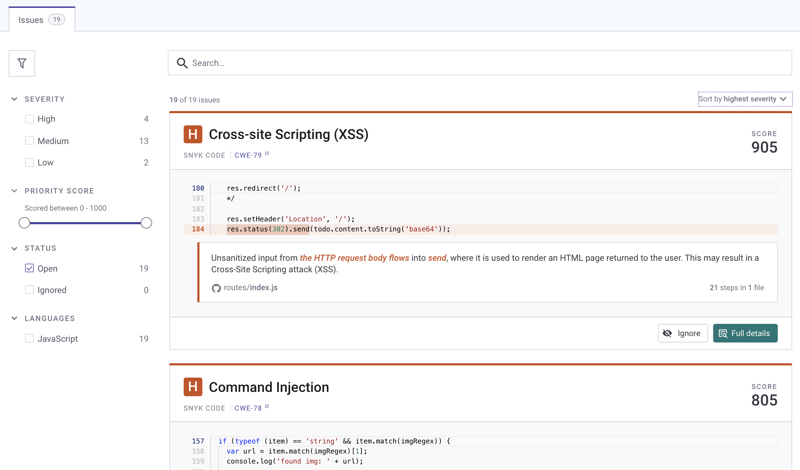
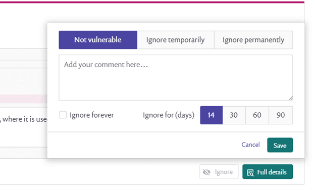

# Using Snyk Code \(web\)

Use Snyk Code with the standard Snyk web interface to find and fix vulnerabilities in your code.

## View project vulnerabilities


See [Getting started with Snyk Code](https://docs.snyk.io/getting-started/getting-started-snyk-products/getting-started-with-snyk-code) for details of how to import and scan projects.


1. In your **Projects** area, select the project to open
2. Snyk Code displays information and vulnerability cards for that project: 

Information available shows standard Snyk project information \(see [Snyk projects](https://support.snyk.io/hc/en-us/sections/360004724958-Snyk-projects)\), including:

* Snapshot information showing when the project was last tested.
* **Overview**, **History** and **Settings** information. For example, use the **History** section to view previous snapshots of projects.
* Filters on the left of the screen.

## Vulnerability card details

Each vulnerability card shows specific details about that vulnerability:

Card details include:

* The level \(for example, **H** for high\), the name \(for example, **Cross-site Scripting**\), and the [Priority Score](https://docs.snyk.io/fixing-and-prioritizing-issues/starting-to-fix-vulnerabilities/snyk-priority-score) value.
* The [CWE type:](https://cwe.mitre.org/data/index.html) click the link to view more information about that type of vulnerability.
* A snippet of your code showing the exact area that is vulnerable.
* A clear and helpful text description of the vulnerability.

See [Issue card information](https://docs.snyk.io/getting-started/introduction-to-snyk-projects/issue-card-information) for more details.

* Click **Ignore** to ignore this vulnerability \(see [Ignore a vulnerability](using-snyk-code-web.md)\)
* Click **Full details** to view more information \(see [View full details](using-snyk-code-web.md)\).

## Ignore a vulnerability


Ignore functionality is not offered for Open Source repositories.


Use the **Ignore** button to suppress specific warnings, ignoring suggestions for fixes for that issue. For example, you may have deliberately used hard coded passwords to test your routines in test code, or you are aware of an issue but have decided not to fix it.

After you click **Ignore**, you are prompted to provide more details:

Select:

* Whether this is to be marked **Not vulnerable**, **ignore temporarily** \(to suppress the message for now\), or **ignore permanently** \(won’t fix ever\)
* Add any notes to yourself or your colleagues in the comment box; we recommend writing a quick explanation for your decision.
* Set a timer for how long to ignore the issue \(14, 30, 60, or 90 days, or click **Ignore forever**\).

Click **Save** to ignore this issue with the parameters selected. Afer you select to ignore an issue, it does not appear in scan results.


There is a status selector for ignored issues on the left side, and you can include those \(and remove or edit the ignore flag\) if you want to review ignored results.


See [Ignoring issues not prioritized for your project](https://docs.snyk.io/fixing-and-prioritizing-issues/issue-management/ignore-issues) for full details of using the Ignore function.

See [Ignoring issues in Snyk Code](https://docs.snyk.io/fixing-and-prioritizing-issues/issue-management/ignore-issues#Ignore-Snyk-Code) for specific details of how Snyk Code processes the Ignore function.

## View full details

Click **Full details** from a vulnerability card to view more information:

Full details include all the information in the vulnerability card, plus:

* **Data flow**: this area on the left shows the full taint flow of the issue in the code, from the source \(the user input\) to the sink \(the operation that needs to receive clean input and can be exploited otherwise\). In the above example, the developer has not sanitized the input, allowing an attacker to do a pass traversal to potentially access any file on the file system, including sensitive data such as password files.
* **Fix analysis:** insight into the remediation and background of the issue itself. Developers are able to see fix-related information, vulnerability overview information \(understanding and approach\), and fix examples for this vulnerability type.
* A link to the source file, which you can open to make changes directly \(see [Open the source code file](using-snyk-code-web.md)\).
* A full window showing the code affected, with specific lines highlighted to accompany the **Data flow** information.

## Open the source code file

1. Click the code link to open the source code file itself \(for example, in GitHub\)

   

2. The file opens, showing you exactly where to fix the vulnerability \(in this example, by adding the sanitation required to the input\).
3. You can now make the fix as required, to address the vulnerability in your code.

## Example: Cross-site Scripting \(XSS\)

This shows an example of a common vulnerability, Cross-site Scripting \(XSS\). XSS vulnerabilities allow attackers to compromise the interactions users have with your application, including gaining control over the application's functionality and data.

The vulnerability card shows key information about this vulnerability:

Click **Full details** to see more information about this vulnerability:

\(This example shows a non-sanitized, HTTP input flows into a **write** response returned by the server, so could be running malicious code.\)

Cick the code link to open the source code file directly, then make changes to fix this vulnerability.


Ready to get started with Snyk? [Sign up for free!](https://snyk.io/login?cta=sign-up&loc=footer&page=support_docs_page)


