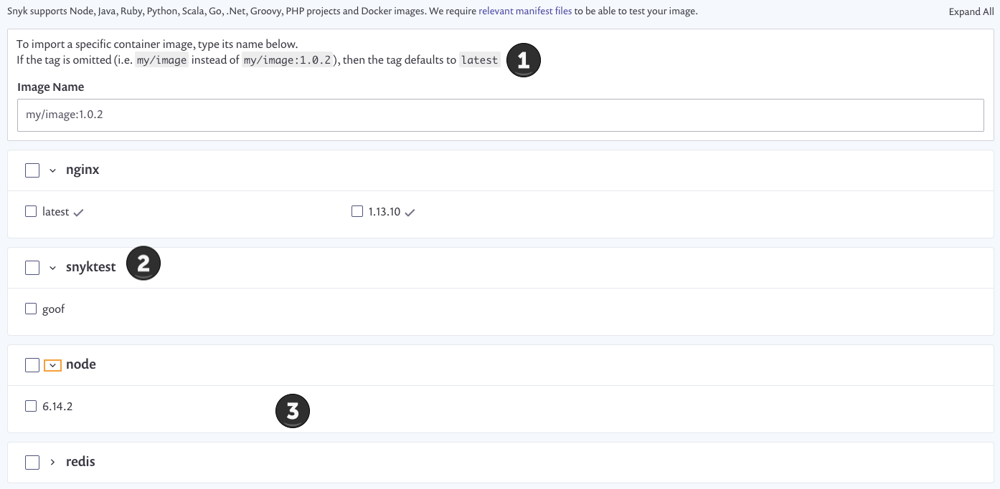
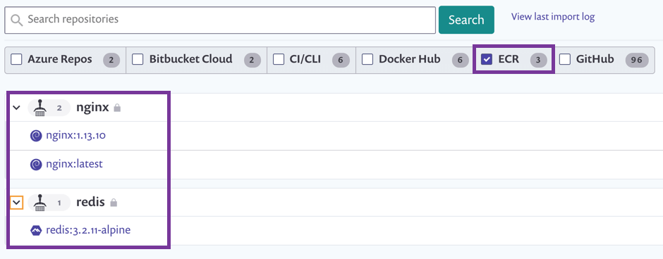

# Amazon Elastic Container Registry \(ECR\): add images to Snyk

Snyk tests and monitors your Amazon ECR container images by evaluating its tags as they are in your ECR repositories.

**To add images to Snyk:**

**Prerequisites:**

* You must have an account with Snyk and be onboarded to your organization by an administrator.
* Ensure you've configured the integration between Snyk and your ECR repository.

**Steps:**

1. Log in to your account and navigate to the relevant group and organization that you want to manage.

1. Go to **Projects**, and click **Add projects**. The list of integrations already configured on your account opens, similar to the following:

The **Which images do you want to test?** view appears, displaying all of the available images for the registry to which you connected, grouped by each of your repositories, similar to the following:

1. Select single or multiple images with any or all of the following methods:
   * Type the name of a single image for import in the **Image Name** field \(\#1 in the image above\),
   * Select any of the repositories if you want to import all of the associated images \(\#2 in the image above\).
   * Expand and collapse repositories to select multiple images \(\#3 in the image above\) across multiple repositories.
2. Click **Add selected repositories**.

   A status bar appears at the top of the page as the images are imported; you can continue working in the meantime.

3. When the import ends, notification of success, or failure, appears at the top of the page. Click Refresh to view the Projects page with the newly imported images. Images are grouped by repository and are each linked individually to a detailed Projects page.
4. You can now connect your Git repo to this project in order to use your Dockerfile for enriched remediation advice. For more info, see [Adding your Dockerfile and test your base image](https://support.snyk.io/hc/articles/360003916218#UUID-9ab347a6-8af0-ef6c-5ebd-cec21fbfab29).

ECR files are indicated with a unique icon

,

You can now filter to view only those projects:

Amazon ECR integration works similar to our other integrations. To continue to monitor, remediate and manage your projects, see the relevant pages, also in our docs.

