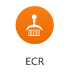

# Amazon Elastic Container Registry \(ECR\): configure your integration with Snyk

Once you create or update an IAM role, allow a few minutes for AWS to update the role on their servers before continuing.

1. From AWS, copy the **Role ARN** key that appears at the top of the **Summary** section \(inside the **Role** area still\).
2. Now, log in to your Snyk account.
3. Navigate to **Integrations** from the menu bar at the top, find and click the Amazon ECR option:



The Amazon ECR configuration page in the Settings area loads.

Enter credentials as follows:

**AWS Region**—use the format region-part-\#. For example eu-west-3. You must enter the default region as configured for your AWS account in order for your repositories and images to be available for import.

**Role ARN**—copy from your AWS account, in the format `arn:aws:iam:::role/`.

For example:

```text
   arn:aws:iam::881001789406:role/TestSnykIntegration_role
```

1. Click **Save**.

Snyk tests the connection values and the page reloads, now displaying Amazon ECR integration details as you entered them. A confirmation message that the details were saved also appears in green at the top of the screen.


In addition, if the connection to AWS failed, notification appears under the **Connected to Amazon ECR** section.

