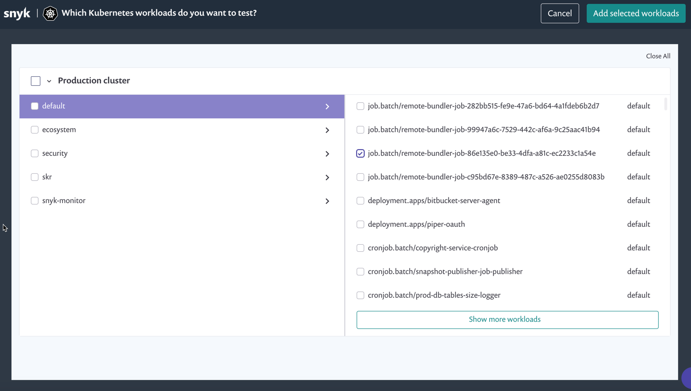
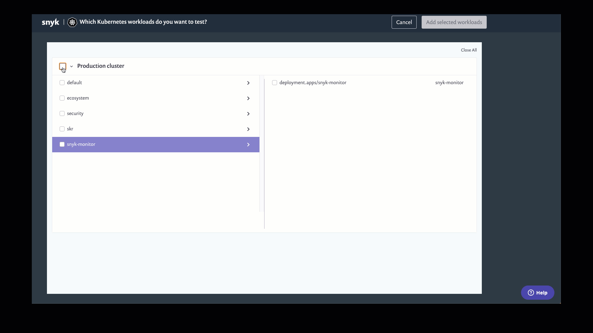

# Adding Kubernetes workloads for security scanning

Once an administrator for your Snyk account has installed the Snyk controller on your Kubernetes cluster, add workloads for testing as follows:

* [Snyk collaborators can manually add new Kubernetes projects](snyk-container/image-scanning-library/kubernetes-workload-and-image-scanning/adding-kubernetes-workloads-for-security-scanning/)
* [Kubernetes collaborators can mark workloads from the cluster to be automatically added to Snyk](https://support.snyk.io/hc/en-us/articles/360003947117-Adding-Kubernetes-workloads-for-security-scanning#UUID-38239f46-6777-97c6-61a1-2074ff981f65/)

## Prerequisites

You must have an account with Snyk and be onboarded to your organization by an administrator.

In addition, the integration must be configured between Snyk and your Kubernetes environment per organization. To verify the integration is configured, ensure you have an Integration ID:

1. Navigate to the relevant organization.
2. Click on settings  &gt; **Integrations**. 
3. In the Kubernetes section, click **Edit Settings**. 
4. Scroll to the **Integration ID** entry and check this is set.

## Automatically add, update and remove workloads

Once you’ve configured the integration between Snyk and your cluster, you can annotate your workloads in order to have them automatically added as projects for testing in Snyk.


The annotated import happens when the **image** itself changes \(rescans the workload due to image change\) or when the **workload details** change \(which creates a new revision of the workload\). Changing the annotation for the workload will not cause a workload change.

If the workload is only annotated after it has been scanned by `snyk monitor`--the annotation will not be recognized until a significant change takes place that causes a full rescan. Terminating the `snyk monitor` pod is one way to force a rescan.


Annotate any of the following workload types:

* Deployments
* ReplicaSets
* DaemonSets
* StatefulSets
* Jobs
* CronJobs
* ReplicationControllers
* Pods

**Steps**

1. Log in to your account and navigate to the relevant group and organization that you want to manage.
2. Click on settings  &gt; **General**. 3. Copy the **Organization ID** value. 4. Add an annotation to the workload with the key `orgs.k8s.snyk.io/v1` , entering the Organization ID as the value, in a comma-separated list.

You can also annotate a single workload to be added to multiple organizations.

1. Now, the Snyk controller automatically picks up on the changes to your workload and ensures that the workload is automatically imported to Snyk as a Snyk project.

   Example 1. Example of a Deployment YAML file annotated to be automatically imported into an organization

   ```text
   apiVersion: apps/v1
   kind: Deployment
   metadata:
     name: my-app-deployment
     annotations:
       orgs.k8s.snyk.io/v1: cacb791e-07cc-4b10-b4be-64de19f532f1
   spec:
     template:
       spec:
         containers:
         …
   ```

   To annotate for multiple organizations, use a comma-separated list.

2. Once imported, the project remains in your Snyk organization even if you remove the annotation. To remove the project from Snyk, you should delete the annotation and delete it from the Snyk UI or [with the API](https://snyk.docs.apiary.io/#reference/projects/individual-project/delete-a-project).

## Manually add workloads

Go to the **Projects page**, click **Add project** and select the **Kubernetes** option.


The import screen loads, similar to the one below, displaying all namespaces from the Kubernetes environment on the left and relevant namespace workloads on the right:



We purposely ignore scanning certain namespaces which we believe are internal to Kubernetes \(any namespace starting with _**kube-\***_\), therefore you won't see those namespaces in the list, as well as the workloads they contain.  
The full list of ignored namespaces can be found [here](https://github.com/snyk/kubernetes-monitor/blob/master/src/supervisor/watchers/internal-namespaces.ts/). This can be configured by adding the following to helm when setting up the snyk-monitor:

```text
      --set excludedNamespaces={kube-node-lease,local-path-storage,some_namespace}
```

* Select one or multiple namespaces from the left side and for each namespace, select one or multiple workloads to import from the right side.



* When ready, click **Add selected workloads** from the top right of the screen. When the import completes, the Projects page loads and all workloads that you’ve imported appear, with a unique Kubernetes icon:


Each item is named according to its Kubernetes metadata as follows: **&lt;namespace&gt;/&lt;kind&gt;/&lt;name&gt;**.

You can filter for Kubernetes projects only:



Ready to get started with Snyk? [Sign up for free!](https://snyk.io/login?cta=sign-up&loc=footer&page=support_docs_page)


