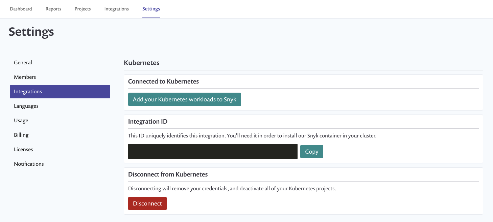

# Disable the Kubernetes integration

If you want to disable the Kubernetes integration first uninstall the controller from your cluster. You can use Helm to do so, or if you’re not using helm simply remove the snyk-monitor namespace. With Helm you need to determine the release name, for instance:

`$ helm ls --short`

`snyk-monitor`

With that, you can delete the release.

`$ helm delete snyk-monitor`

With the controller removed, within the Integration Settings in Snyk you can hit the Disconnect button which will invalidate the credentials used to import and synchronize new workloads.


Ready to get started with Snyk? [Sign up for free!](https://snyk.io/login?cta=sign-up&loc=footer&page=support_docs_page)


