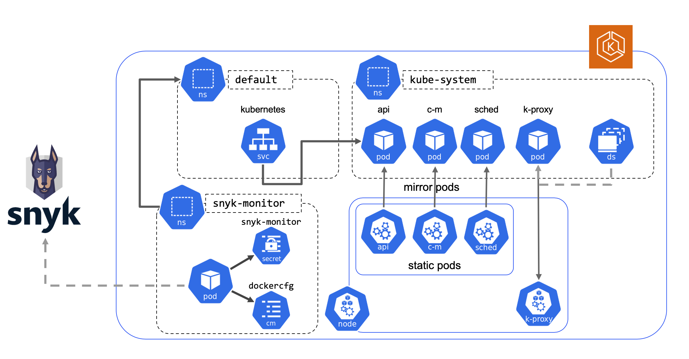

# Install the Snyk controller on Amazon Elastic Kubernetes Service \(Amazon EKS\)

Installing the Snyk controller enables you to import and test your running EKS workloads and identify vulnerabilities in their associated images and configurations that might make those workloads less secure. Once imported, Snyk continues to monitor those workloads, identifying additional security issues as new images are deployed and the workload configuration changes.

You have the option of deploying the Snyk controller for Amazon EKS as an official [AWS Quick Start](https://github.com/aws-quickstart/quickstart-eks-snyk). This option eliminates the need for manual configuration. Deploying this Quick Start with default parameters into an existing Amazon EKS cluster builds the following environment.

There are three deployment options to match most common use cases. These are as follows:

**1.** If you already have an Amazon EKS cluster running in your AWS account

**2.** If you already have anAmazon Virtual Private Cloud \(Amazon VPC\) but need an Amazon EKS cluster _**with**_ the Snyk controller deployed to the cluster

**3.** If you have neither an Amazon VPC or Amazon EKS cluster and need all services _**with**_ the Snyk controller deployed to the cluster

## **Prerequisites**


**Feature availability**  
This feature is available with all paid plans. See [pricing plans](https://snyk.io/plans/) for more details.


* An administrator account for your Snyk organization.
* A minimum of 50 GB of storage must be available in the form of an [emptyDir](https://kubernetes.io/docs/concepts/storage/volumes/#emptydir) on the cluster.
* Your Kubernetes cluster needs to be able to communicate with Snyk outbound over HTTPS.
* When configuring Snyk to integrate with an Amazon Elastic Kubernetes Services \(EKS\) cluster, if you wish to scan images hosted on your Amazon Elastic Container Registry \(ECR\), you may also deploy our Quick Start, [Snyk Security on AWS](https://aws.amazon.com/quickstart/architecture/snyk-security/) to enable this integration.

## [Deployment Guide](https://aws-quickstart.github.io/quickstart-eks-snyk/)

## Configure snyk-monitor to pull and scan images from ECR

For all the options above, **add** **the IAM policy** that can be found [here](https://docs.aws.amazon.com/AmazonECR/latest/userguide/ECR_on_EKS.html) to your EKS worker nodes in order for the snyk-monitor to pull private images when running on those worker nodes.

**NOTE:** _Please review the_ [_parameter reference_](https://github.com/aws-quickstart/quickstart-eks-snyk#parameter-reference) _prior to deployment._

