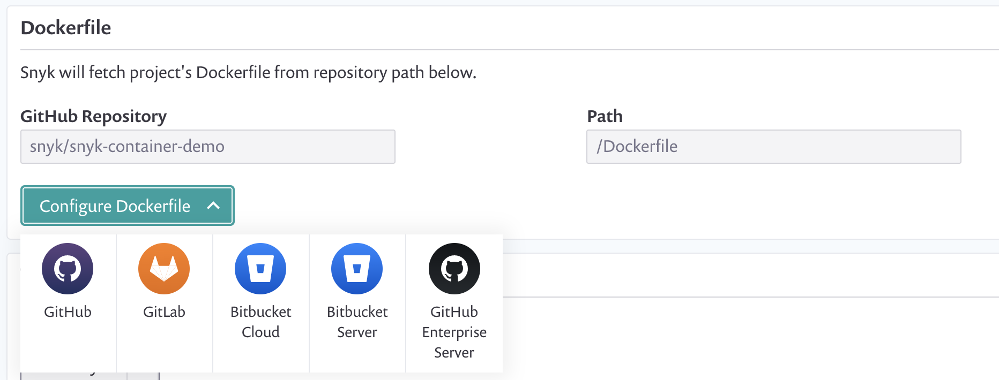
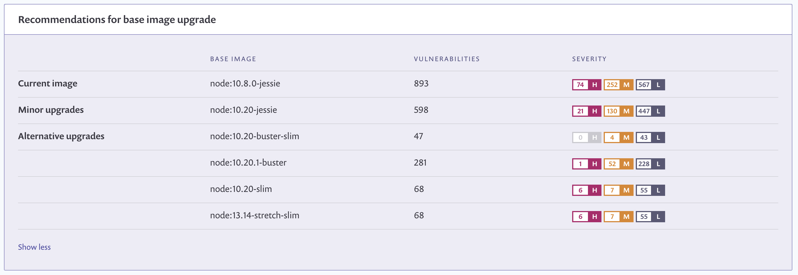

# Adding your Dockerfile and test your base image

To receive base image remediation advice, including major, minor and alternative upgrades as well as advice when you need to rebuild your image, integrate with your preferred Git repository and import the repo that contains the relevant Dockerfile.

You can add a single Dockerfile to each image that you've imported.

**To add your Dockerfile for additional remediation advice:**

**Prerequisites:**

* Ensure the relevant Git repository has been configured.
* Import the relevant image from its registry first.

**Steps:**

1. From the Project tab, filter for your project and then click the settings cog to access the settings to add a Dockerfile:

   

2. From the Project settings page, click Configure Dockerfile and then select the relevant Git:

   

3. The **Add Projects** view appears, displaying all repositories from the Git account with which you integrated, grouped per organization and personal account:  

   

4. Checkmark the relevant repo from which to import the Dockerfile.
5. Step 2 loads:  

   

6. Enter the relative path in the Path to your Dockerfile field in the following format: /path/dockerfile.
7. Click **Save**.

Snyk tests the project again, this time producing any relevant base image remediation advice such as in the following example:

