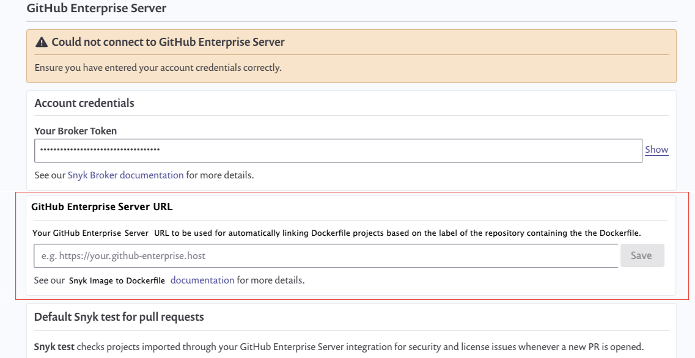

# Automatically link between Dockerfile and images using labels

Snyk allows you to manually or automatically link from a Dockerfile to all container images built from it. You can use this to understand the security impact on your running applications, and understand which images can be better secured, or need to be rebuilt, when taking action and updating the Dockerfile base image.

This information appears in the **LINKED IMAGES** section of the details for a project:

You can get automatic links between imported images \(via container registry integration\) to existing Dockerfile projects. This is done by checking whether the OCI label in the image matches the path of a Dockerfile that exists in the org in Snyk.

At the point of import \(or re-test\), the image is analysed, scanned for vulnerabilities and image labels are also retrieved from image manifest. Snyk then checks whether:

* Image labels defining dockerfile location exist:
  * `org.opencontainers.image.source` - URL to the project repo \(mandatory\)
  * `io.snyk.containers.image.dockerfile` - path to Dockerfile, e.g.: "/Dockerfile-prod" \(optional\)
* Dockerfile project exists in the same org, with a matching repo \(and path or /Dockerfile\) from the image labels

If the above applies, Snyk automatically creates a link between the image and dockerfile projects.

## Automatic update/removal of links

Links are automatically updated if the Dockerfile labels are updated and are targeting new location. This can happen at the time of retest or when a recurring test runs.

Links are removed if either the image project or Dockerfile project are deleted, if the Dockerfile labels are updated so that they target Dockerfile location without an existing project in Snyk, or if the Dockerfile labels are removed.

## Linking in brokered SCM integrations

For a link to be created, Snyk needs to be able to map the Dockerfile repository URL to the right SCM org source. For brokered integrations this is a bit more complex, as this URL is not available by default.

To create automatic links between container images to Dockerfiles stored in brokered SCMs, enter the URL in the integration page settings:

Once available, Snyk can use that for linking generation.

