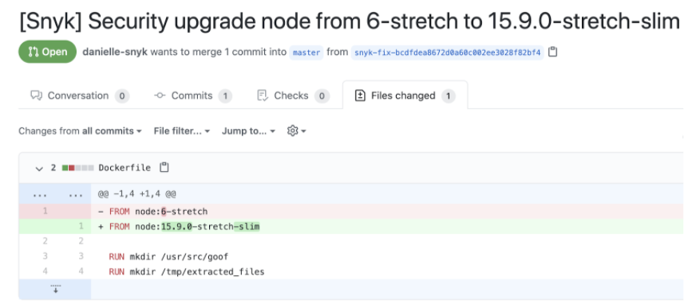

# Open pull requests to fix vulnerable base images in your Dockerfile

Snyk detects vulnerable base images by scanning your Dockerfile when importing a Git repository, and helps you fix them using automatic pull requests. This allows you to examine security issues before you build the image, and fix them before they land in your registry or in production.

Supported git-based repository managers for Dockerfile fix PRs include:

* GitHub
* GitLab
* Bitbucket Server
* Bitbucket Cloud
* GitHub Enterprise Server
* Azure repos

For any Dockerfile project created in Snyk, if the base image is an [Official Docker image](https://docs.docker.com/docker-hub/official_images/), the results include a list of suitable base images that can be used instead of the existing, more vulnerable one. See the section on [base image recommendations](https://docs.snyk.io/snyk-container/getting-around-the-snyk-container-ui/analysis-and-remediation-for-your-images-from-the-snyk-app) for more information.

Snyk then automatically issues a fix pull request against your Dockerfile, to upgrade to the latest minor version available.

Automatic fix PR is opened in case there is a change in the Dockerfile or a better base image detected post the initial scan.

Alternatively, manually open a fix PR by clicking **Open a Fix PR** for the version you wish to upgrade to.

After it is opened, you can view the fix PR in your Git repository, showing what the change is and where it takes place. The FROM line in your Dockerfile is updated with the new and improved version.

**Note:** we recommend making sure your application works properly before merging the change.

Once the PR is opened and ready, you can safely merge it and instantly reduce the number of vulnerabilities in your container image.  

Availability:

The feature is available for all of our users. It is on by default for all free users, and off by default for Snyk customers' existing integrations. You can opt-in to it from the integration or project settings sections.

