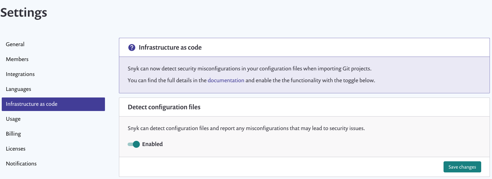
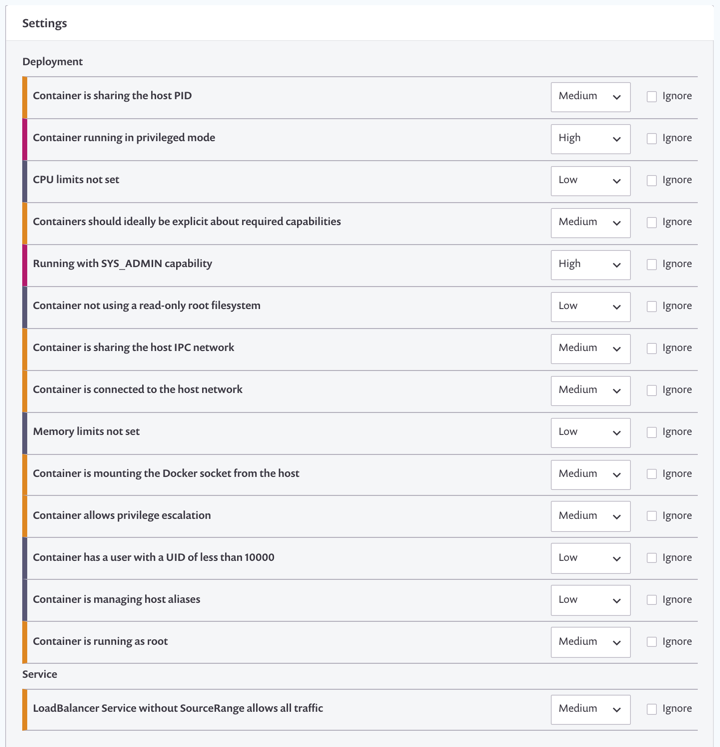

# Configure integration for security issues in Kubernetes configuration files

Snyk tests and monitors Kubernetes configurations stored in your source code repositories and provides information, tips, and tricks to better secure a Kubernetes environment--catching misconfigurations before they are pushed to production as well as providing fixes for vulnerabilities.

## Supported Git repositories and file formats

Snyk currently scans your Kubernetes configuration files in JSON and YAML format when imported from your integrated Git repository.

## Configure Snyk to scan Kubernetes configuration files

**Prerequisites**

* Administrator access for the organization
* Check Git repository access and authorization--more info at [Git repository \(SCM\) integrations](https://support.snyk.io/hc/en-us/sections/360001138098-Git-repository-SCM-integrations).

**Configure Snyk**

1. Log in to [app.snyk.io](https://app.snyk.io/)
2. Navigate to the relevant group and organization that you want to manage

**NOTE**

Integrations are managed per organization.

1. Enable Snyk to detect Kubernetes configuration files by enabling the flag in the settings  &gt; **Infrastructure as code** page: 
2. If needed, review and adjust settings in the **Infrastructure as code** settings:

The number of tests per product are based on account plans. For information on plans and test limits, [view our plans](https://snyk.io/plans/).

