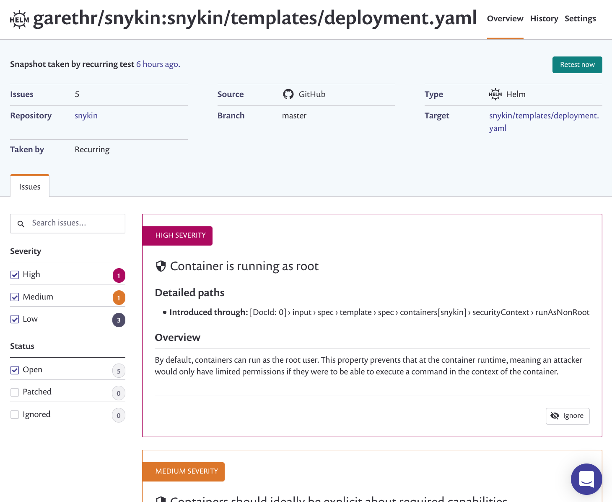

# Scan and fix security issues in Helm Charts

Snyk scans Helm Charts, in addition to Kubernetes configuration files, for misconfigurations and security issues. Once Helm Charts are scanned, Snyk creates projects for each template and dependency template, generates reports on any misconfigurations, and makes recommendations for fixing them.

## Prerequisites

* An administrator should [connect your organization](../scan-terraform-files/configure-your-integration-to-find-security-issues-in-your-terraform-filess/) with your preferred Git repository and enable detection of configuration files as described.
* The repository should follow the [standard Chart directory structure](https://helm.sh/docs/topics/charts/#the-chart-file-structure/). Specifically we look for:
  * `Chart.yaml` - YAML file containing information about the chart
  * `values.yaml` - The default configuration values for this chart
  * `templates/` - A directory of templates that, when combined with values will generate valid Kubernetes manifest files.
  * `Values` - An optional directory of values that used to configure different environments.
  * `requirements.yaml` - Optional file - Additional way to declare dependencies

## Scan and fix your Charts

1. Log in to your account and navigate to the relevant group and organization that you want to manage.
2. If you already imported your repositories for testing before cloud configuration file detection was enabled by your administrator, then you should re-import that repository again in order to import the Helm chart:  
3. Every time a repository is scanned:
   1. Each template in your Helm Chart creates a Snyk a project, grouped together by repository.
   2. If you re-imported the repository in order to import the cloud configuration files, then Snyk imports and tests the configuration files and also re-tests the already imported application manifest files - displaying the test time as "now".
4. Click the project link you're interested in, to view the scan results and to correct your configuration files accordingly.
   1. Projects that were created from external dependencies will also be scanned and issues shown.


Ready to get started with Snyk? [Sign up for free!](https://snyk.io/login?cta=sign-up&loc=footer&page=support_docs_page)


