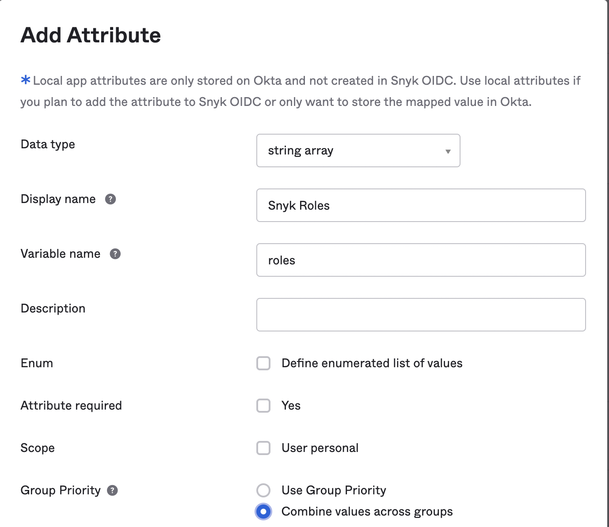

# Scan and fix security issues in Kubernetes configuration files

Snyk Snyk Infrastructure as Code scans your manifest files for security vulnerabilities, and scans your Kubernetes configuration files for misconfigurations and security issues as well. For configuration files, once scanned, Snyk reports on any misconfigurations based on the settings your administrator has implemented, and makes recommendations for fixing accordingly.

## Prerequisites

* An administrator should [integrate your organization ](../scan-terraform-files/configure-your-integration-to-find-security-issues-in-your-terraform-filess.md)with your preferred Git repository and enable detection of configuration files as described.
* You must have a Snyk account and your configuration files should be in either JSON or YAML format.

Snyk Infrastructure as Code supports:

* Deployments, Pods and Services.
* CronJobs, Jobs, StatefulSet, ReplicaSet, DaemonSet, and ReplicationController.

## Scan and fix your configuration files

1. Log in to your account and navigate to the relevant group and organization that you want to manage.
2. If you already imported your repositories for testing before cloud configuration file detection was enabled by your administrator, then you should re-import that repository again in order to import the relevant JSON or YAML configuration files:
3. Every time a repository is scanned:
   1. Every supported manifest file and every supported configuration file is imported as a separate project, grouped together per repository, similar to this example:
   2. If you re-imported the repository in order to import the cloud configuration files, then Snyk imports and tests the configuration files and also re-tests the already imported application manifest files - displaying the test time as "now".
4. Click the project link you're interested in, to view the scan results and to correct your configuration files accordingly: 


Ready to get started with Snyk? [Sign up for free!](https://snyk.io/login?cta=sign-up&loc=footer&page=support_docs_page)


