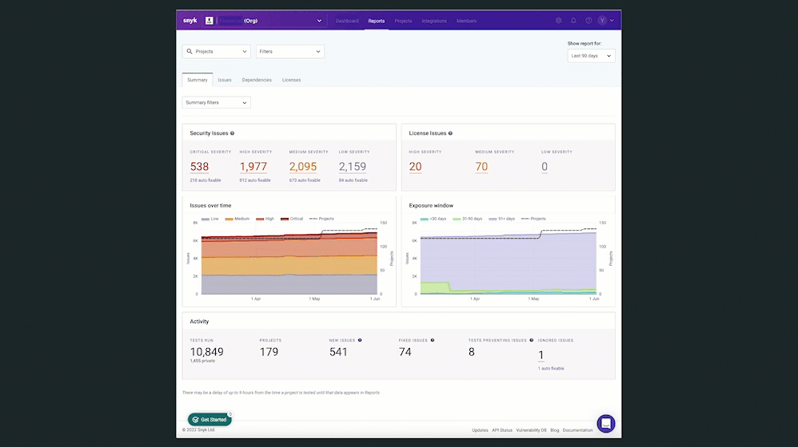

# Getting started with the Snyk Web UI

## Accessing the Snyk Web UI

After you [sign up for a Snyk account, authenticate and log in to Snyk](../getting-started/), the Web UI opens to the [Dashboard](broken-reference/), with a wizard to guide you through setup steps:

1. Identifying where the code you want to monitor in Snyk is located.
2. Defining which projects within your code you want Snyk to scan.
3. Connecting Snyk to the relevant projects to scan them.
4. Reviewing the results of your Snyk scan.


If you're signing into a paid Team, Business, or Enterprise account, you'll also need to select the relevant [organization](../introducing-snyk/groups-organizations-and-users.md) after you log in to Snyk.


.png>)

## What can I do in the Web UI tabs?

* [Explore the dashboard](getting-started-with-the-snyk-web-ui.md#dashboard)
* [Investigate reports](getting-started-with-the-snyk-web-ui.md#reports)
* [Manage projects](getting-started-with-the-snyk-web-ui.md#manage-your-projects)
* [Manage integrations](getting-started-with-the-snyk-web-ui.md#manage-your-integrations)
* [Manage group or organization members](getting-started-with-the-snyk-web-ui.md#manage-organization-or-group-members)
* [View Snyk updates](getting-started-with-the-snyk-web-ui.md#view-product-updates)
* [Get help](getting-started-with-the-snyk-web-ui.md#view-helpful-resources)
* [Manage your user account](getting-started-with-the-snyk-web-ui.md#manage-account-preferences-and-settings)

## [Dashboard](broken-reference/)

View your pending tasks, vulnerable projects, invite team members, and add new projects. The **Pending tasks** section shows the next chores to be handled for the projects in a Snyk organization.

This information includes:

* Pull Requests (PRs) that can be raised to fix vulnerabilities in some of the most vulnerable projects.
* PRs that have already been raised (by or through Snyk) and are open and awaiting review.

Currently, Snyk only tracks and flags PRs in GitHub, GitHub Enterprise, and Bitbucket Cloud, and only for the top-most vulnerable projects. If you use another SCM, **Pending tasks** shows only PRs that can be raised, not PRs that have already been raised.

.png>)

Use the project links to explore and manage the metadata, retest, and fix options for the target files in your projects. The link opens a page where you can view the project **Overview** options, or switch to the **History**, and **Settings** tabs.

* For projects with the **Fix vulnerabilities** link, use the link to view the **Open a Fix PR** summary, where you'll find an option to open a fix PR to implement the upgrades and patches in GitHub that address the issues.\
  This page presents the list of issues with full, partial, or no fixes.
* For the other relevant projects, use **View PR** links to open and view the Snyk-generated PR fixes in GitHub.

.gif>)

## [**Reports**](https://docs.snyk.io/features/reports)

You can view reports to gain visibility and insights into the state of all your projects, vulnerabilities, and license issues.


**Feature availability**\
The **Reports** tab is fully enabled for Business and Enterprise plans.


## **Manage your** [**Projects**](https://docs.snyk.io/getting-started/introduction-to-snyk-projects#projects)

In the **Projects** tab, you can:

* Search, filter, and sort your projects.
* View tips and the import logs for your projects.
* Select and expand specific projects to view analysis summaries, dive into specific vulnerability issues in a project and its associated targets, and add a custom target path to a project.
* Click the target settings icon to configure General and Integration **Settings** for notifications, project testing, and pull request (PR) frequency or switch to the **Overview** and **History** options. You can also look up the unique Project ID, and deactivate or delete a project in the **Settings** page.

## **Manage your** [**Integrations**](https://docs.snyk.io/integrations)

In the **Integrations** tab, you can:

* View the supported environments that can connect to Snyk for vulnerability monitoring.
* Manage [Slack](https://docs.snyk.io/integrations/notifications-ticketing-system-integrations/slack-integration) and [Jira](https://docs.snyk.io/integrations/notifications-ticketing-system-integrations/jira) integrations.
* Access the [Vulnerability management tools](https://docs.snyk.io/integrations/vulnerability-management-tools).

.png>)

## Manage [Organization](https://docs.snyk.io/features/user-and-group-management/managing-users-and-permissions/manage-users-in-your-organizations) or [Group](https://docs.snyk.io/features/user-and-group-management/managing-users-and-permissions/manage-users-in-your-organizations-1) members

Use the **Members** tab to view and manage users, roles, and how users authenticate in your Snyk Organization or Group.


You must be assigned the [relevant Admin roles and permissions](https://docs.snyk.io/features/user-and-group-management/managing-users-and-permissions/managing-permissions) to make changes in the **Members** tab.


### Snyk Organization or Group [Settings](https://docs.snyk.io/introducing-snyk/snyks-core-concepts/snyk-settings)

Use the  menus to view and manage your Organization (team) or Group (company-wide) settings.

.png>)

## View product updates

"Ring the bell" to view a summary from [**snyk.io updates**](https://updates.snyk.io/).

.png>)

## View helpful resources

Use the Help menu for quick access to Snyk user documentation (including the **Getting started** or **CLI** sections), product updates, API documentation, Snyk support, and to check the Snyk status page.

.png>)

## Manage account preferences and settings

This is where you can configure the general [account settings](https://app.snyk.io/account) for your user account, view your authentication token and authorized applications, set your preferred (default) organization, as well as your notification and sharing preferences, and view information on the latest Snyk product updates.

.png>)

### Managing user **account settings**

You can access the following information and options in the Account Settings:

* View and manage your API token (or the Auth Token, for free accounts).
* View the list of your Authorized Applications.
* Set your Preferred Organization.
* Delete your account.
* Manage your notification preferences in the section that relates to Email Notifications, Issue email alerts, the Weekly report, Usage alerts, Report status, and Marketing & Sales Communications.
* Share a Snyk referral link with your friends.
* Log out of Snyk.

